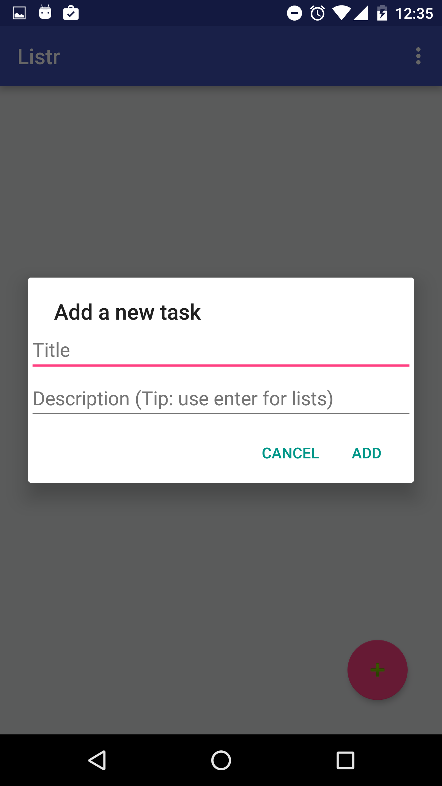

#  Project #1: To-Do List

#### Overview

Welcome to the Listr ReadMe!

This is what we'll be going over:
- What is Listr? (What can Listr do for me?)
- How to use Listr
- Known Bugs
- Future Updates

An interactive demo of Listr is available at:
https://popapp.in/projects/577fc861b9071da51c4e8154/preview

---

#### What is Listr?

Listr is a To-do List app that helps you keep track of all the things.

---

<<<<<<< HEAD
#### How to use Listr
=======
#### Code of Conduct

As always, your app must adhere to General Assembly's [student code of conduct guidelines](https://github.com/ga-adi-nyc/Course-Materials/blob/master/markdown/code-of-conduct.md).
>>>>>>> upstream/master

It all starts on the To-do List Task List screen.

---

#### Necessary Deliverables

- A **git repository hosted on GitHub**, with frequent commits dating back to the **very beginning** of the project. Commit early, commit often.
- **A ``readme.md`` file** describing what the app does, and any bugs that may exist.
- Pictures of your prototypes in the git repository
- At least one screenshot of your home screen in the `readme.md`

---

#### Suggested Ways to Get Started

- Complete as much of the layout XML as possible before starting to write your logic
- Use the Android API documentation - it is very thorough and provides useful code samples
- Don’t hesitate to write throwaway code to solve short term problems
- Write pseudocode before you write actual code (remember to think through the logic first!)

---

### Useful Resources

- [Android API Reference](http://developer.android.com/reference/packages.html)
- [Android API Guides](http://developer.android.com/guide/index.html)

---

#### Example Deliverable

Below you can find an example of what the instructors' final product looks like. **Be creative with your own designs!**

  
  
  
  

#### Project Feedback + Evaluation

Base on the requirements you can earn a maximum of 18 points on this project. Your instructors will score each of your technical requirements using the scale below:

    Score | Expectations
    ----- | ------------
    **0** | _Incomplete._
    **1** | _Does not meet expectations._
    **2** | _Meets expectations, good job!_
    **3** | _Exceeds expectations, you wonderful creature, you!_

 This will serve as a helpful overall gauge of whether you met the project goals, but __the more important scores are the individual ones__ above, which can help you identify where to focus your efforts for the next project!

---

## Licensing
1. All content is licensed under a CC-BY-NC-SA 4.0 license. 
2. All software code is licensed under GNU GPLv3. For commercial use or alternative licensing, please contact legal@ga.co.
